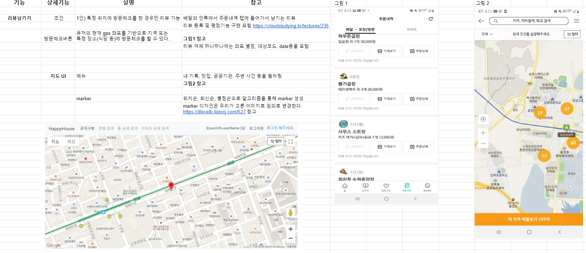
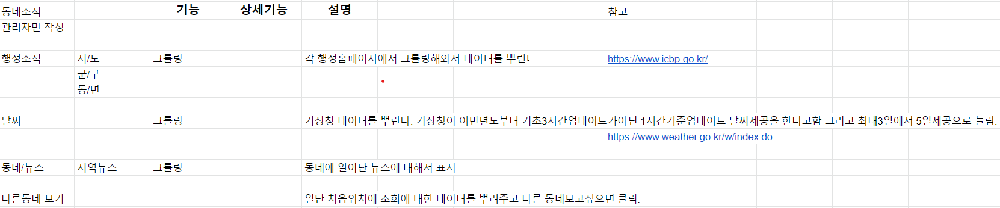
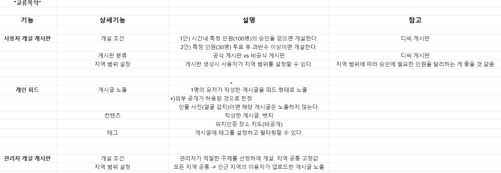
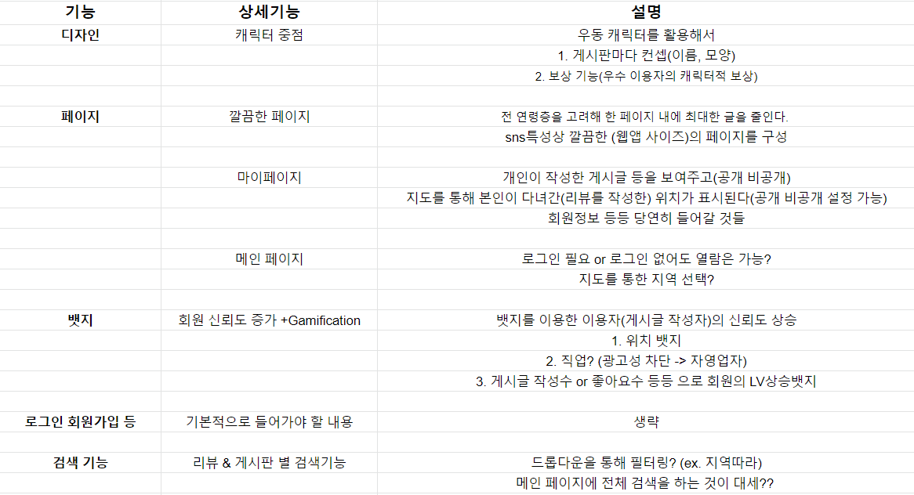

# 0112_미팅기록 - 아이디어/기능

> A404팀 2021년 1월 12일 미팅기록

---

[TOC]

---

## 공지사항

> 매일 jira와 git을 관리하도록 한다!

## 주제

- 현재 아이디어의 강점 및 차별점 리뷰
- 기능별 명세서 작성

## 내용

### 1. 우동의 차별화 방안

1. **리뷰 신뢰성** 향상
   - 영수증 리뷰
   - **뱃지** 적극적으로 활용 - 위치 기반 뱃지, 파워블로거
   - **반익명성** - 직업 인증 뱃지(회사원 4대보험서 인증 등)
   - `구글지도가이드(파워블로그)` 참고

2. 리뷰에 **RPG 개념** 도입
3. **캐릭터 의인화**를 통한 차별성 - 우동 캐릭터에 RPG 기능을 적용
4. **심미적인 디자인**을 통한 차별화
5. **스토리텔링**
6. 피드 - 개인의 인물 사진(사진에서 얼굴이 감지되면)은 필터링하여 피드에 표시되지 않도록 한다.

### 2. 대안 아이디어

**코로나 키워드**

- 거리두기 -> 지역화
- 안전/개인위생
- 자동차 수요 증가
- 비대면 서비스 증가
- 실내 문화/놀이 관심

**SNS 추세**

- 노년층 증가
- 개방성 + 폐쇄성(밴드)
- 인스타, 페이스북: 나와의 연관성(내면화)
- 다른 사람의 것을 편하게 볼 수 있는 디자인(모바일)

### 3. 컨설턴트님 피드백

- 카테고리/지역 범위 줄이기(개발자 작업 부담)
- 초기 사용자 유인방안
- 광고 등 업체들과도 공생할 수 있는 커뮤니티 재고
- 사업 수익성 고민해보기
- 광고성 리뷰 필터링 방안 구체화

### 4. 팀원들 간의 피드백

- 개발자가 제한을 하면 클라이언트의 사용에 있어서 유연성이 떨어진다.
- 특정 동을 넘어선 구 단위의 정보가필요할수도(ㅇㅇㅇ센터)
- 동네의 저작거리 이야기는 재미구조로 넣어야 한다.
- 지도 map 위에 marker로 우리 동네의 특이사항 표기. 알고리즘 접목시켜서
- 움직일때 방문체크 하고 거기에 대한 리뷰남기기.(지도 map 위에 marker)
- 지도가 표기되는 페이지를 여러개로 구성하지 말고, 한 페이지에 지도를 띄우고 메뉴를 통해 원하는 정보를 marker로 표시.

### 5. 피드백에 대한 대안

|                     피드백                      |                           해결방안                           |                             설명                             |
| :---------------------------------------------: | :----------------------------------------------------------: | :----------------------------------------------------------: |
|   카테고리/지역 범위 줄이기(개발자 작업 부담)   | - 관리자 개입 요소 축소 - 지역 축소 - 리뷰 카테고리 축소 | - 관리자가 주관적으로 개입할 수 있는 부분들을 감축시킨다. - 베타 서비스로 한정된 지역을 먼저 개시하고 이후 지역을 확장해나간다. - 리뷰는 병원,음식,등 한정적으로하되 커뮤니티는 자유롭게? |
|              초기 사용자 유인방안               |         - RPG 서비스 연계 - 초기 데이터 크롤링          | - 경험치/티어로 '우동' 캐릭터를 꾸밀 수 있게 한다. - 아바타 구현이 어렵다 |
| 광고 등 업체들과도 공생할 수 있는 커뮤니티 재고 |                   - 지역 소식 게시판 권한                    |   - 지역 가게들의 개업소식, 행사 등을 넣을 수 있도록 한다.   |
|             사업 수익성 고민해보기              |       - 광고 - 제휴 - 행정소식 공공기관 연계       | - `동네소식 > 지역상점` 코너에서 광고를 받는다. - 매장과 쿠폰 등 서비스 제휴는 맺는다. - 행정소식, 코로나 알림 등 공지사항을 B2G로 협약한다. |
|         광고성 리뷰 필터링 방안 구체화          |                      - 위치 저장 서비스                      | - 해당 위치에서 방문ㅊ체크를 하고 이후 해당 지점에서의 리뷰를 남길 수 있게한다. |
|                 지역 구분 문제                  |                         - 반경 활용                          |  - 위치 정보 기준으로 반경 **km 이내의 정보로 sorting한다.   |
|                     시각화                      |                          - 지도활용                          | - 언급 빈도에 따라 지도에서 지점을 다르게 표시하여 시각화한다. |

**기타**

- 연령대나 특정집단(학부모) 등에 따라서 필요한 리뷰 카테고리를 선별한다. (학원 정보 등)

## 정리

> 피드백을 바탕으로 구현 기능과 해당 기능의 명세를 작성하였다.
>
> [참고링크](https://docs.google.com/spreadsheets/d/1grVUxz6qSfn_2bLdnIeJrzDdRW30SrpIzh33N2PplIU/edit#gid=731007643)

### 리뷰 기능 명세

### 소식 기능 명세

### 

### 커뮤니티 기능 명세

### 기타 기능 명세

## :hand: 다음과제

- **내일 오전 - 기능명세서 검토 및 피드백**:exclamation:
- **내일 오후 - 기능별 페이지 디자인**:exclamation: