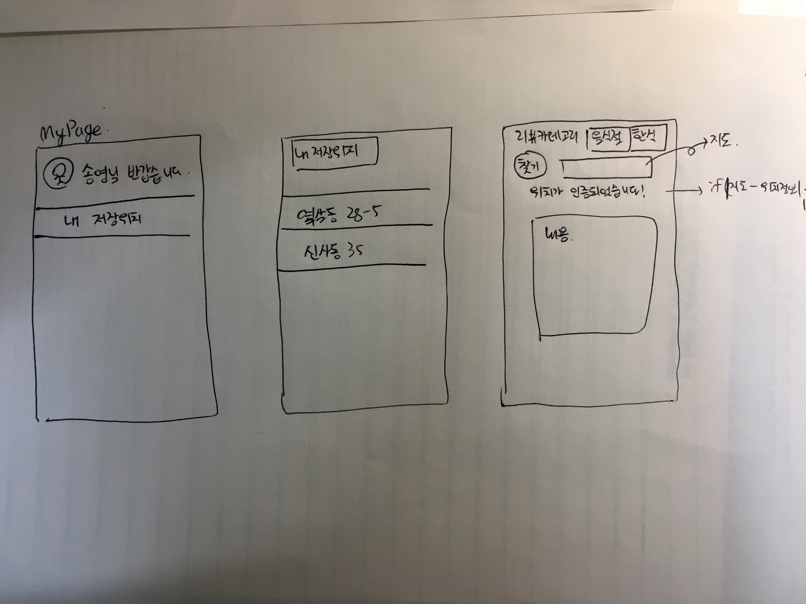
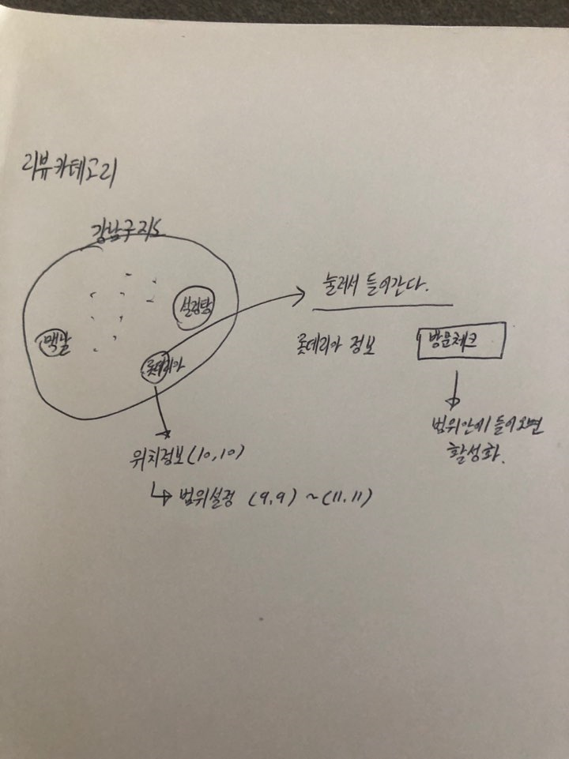
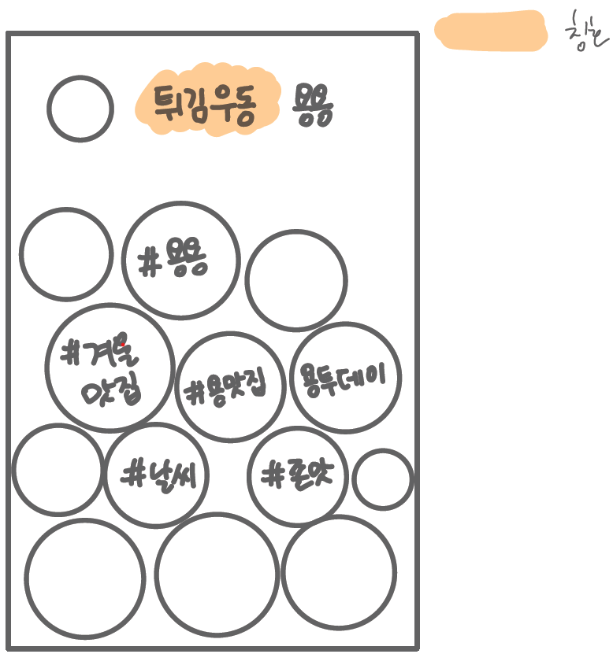
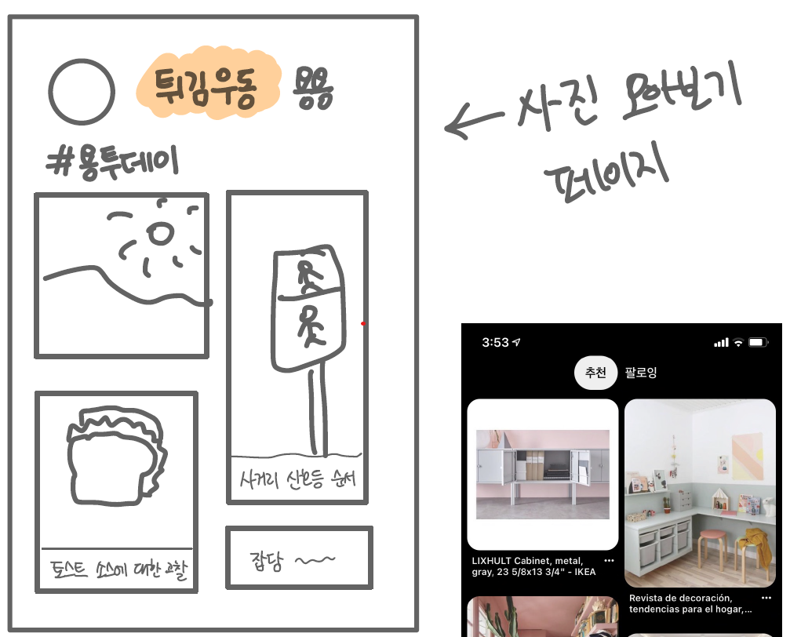

# 0113_미팅기록 - 서비스/기능

> 서울4반_4팀 2021년 1월 13일 미팅기록

---

[TOC]

---

## 공지사항

> (별도 공지 없음)

- 공통프로젝트가 포트폴리오에 가장 도움이 되니 모두 열심히 할 수 있도록~~~~!!! :smile:

## 주제

- `jira`, `spring` 등 프로젝트에 필요한 툴 학습
- skeleton코드 확인
- 기능명세 검토 및 피드백

## 내용

### 1. 리뷰 서비스

#### 1.1 리뷰 작성 과정

> 위치인증정보, 지도를 기반으로 리뷰 작성 과정에 대해서 논의하였다.

**1안: 리뷰대상과 위치인증정보 비교**

**2안: 위치인증정보 근처 범위내 리뷰대상 선택**

#### 1.2 리뷰 카테고리 분류

| 리뷰 카테고리  |
| :------------: |
|   식당/카페    |
|      마트      |
|      병원      |
|      의류      |
|     헤어샵     |
|     편의점     |
|    공공시설    |
| 기타(근린시설) |

- 기존에 계획하였던, 이외의 리뷰에 대해서는 `커뮤니티` 서비스에서 그 기능을 보완할 수 있도록 대안을 마련한다.

### 2. 소식 서비스

추가적으로 반영된 사안을 다음과 같다.

- :heavy_check_mark: `행정소식`
  - 나중에 행정기관 관련 관리자가 접근하여 작성할 수 있도록 모델 필드를 생성해놓는다.
- :heavy_check_mark: `동네뉴스`
  - `시/도-군/구-동/면`의 지역뉴스를 크롤링하여 일관적으로 보여준다.
  - 이후 지역신문사에서 직접 게시할 수 있는 부분도 논의해본다.
- :heavy_check_mark: `자유홍보`
  - `자유홍보` 코너를 만들고 `개업소식`, `할인행사` 등의 게시판을 마련하여 사업자들 자신의 사업체를 홍보할 수 있는 공간을 만든다.

### 3. 커뮤니티 서비스

3가지 안 중에서 `개인 피드` 형식으로 커뮤니티 서비스를 구성하기로 결정했다.

|    분류     |                             설명                             |
| :---------: | :----------------------------------------------------------: |
| 게시글 노출 | - 1명의 유저가 작성한 게시글을 피드 형태로 노출 +)외부 공개가 허용된 것으로 한정 - 인물 사진(얼굴 감지)이면 해당 게시글은 노출하지 않는다. |
|   컨텐츠    |   - 작성한 게시글, 뱃지 - 위치인증 장소 지도(비공개)    |
|    태그     |          게시글에 태그를 설정하고 필터링할 수 있다.          |
|   자유도    |                          캐쥬얼하게                          |

**기대효과**

- 부족한 리뷰 카테고리 부분을 보오나해줄 수 있다.
- 다양한 정보의 공유 및 커뮤니티로서의 소통이 가능하다.

**커뮤니티 컨셉**

### 4. 기타

> 전체적인 디자인은 UX 향상을 위한 심플함을 지향한다.

#### 4.1 마이페이지

- 마이페이지 예시

  

#### 4.2 뱃지

- 사용자 페이지에서는 컬렉션을 열람할 수 있도록 한다.
- 대표배지를 어떻게 표시해야할지에 대한 사안은 조금 더 논의해본다.

**<참고> 경험치/레벨**

이 기능에 대해서는 우선순위를 미뤄놓고 추후에 다시 논의해본다.

- 글/댓글 작성에 따라서 경험치를 부여하고 그에따른 레벨도 지정한다.
- 레벨에 따라서 다른 뱃지부여
- 레벨 별로, 유저 이름이 표시되는 색상이 다르다.

#### 4.3 캐릭터

- 우동 캐릭터를 만든다.
- 우동의 상징적인 색상(흰색, 갈색, 핑크색 등)을 배합하여 웹페이지의 전체적인 디자인 색상을 결정한다.

## 정리

**서비스별 간략한 요약**

|          |       백        | 프론트 |  DB  |
| :------: | :-------------: | :----: | :--: |
|   리뷰   |    기능 CRUD    |  지도  |      |
|          |    알고리즘     |        |      |
|   소식   |       CRD       |        |      |
|          | 알고리즘 크롤링 |        |      |
| 커뮤니티 |      CRUD       |        |      |
|          |  추천 알고리즘  |        |      |

## :hand: 다음과제

### 내일 할일

- :star: 서비스 별 기능 디자인
- :star: 서비스 별 기능 정리

### 차후 계획

- :star: 금요일 DB 정리 및 만들기
- :star: 이후 협업하여 백엔드 개발 후 프론트엔드 개발로 순차적으로 진행

