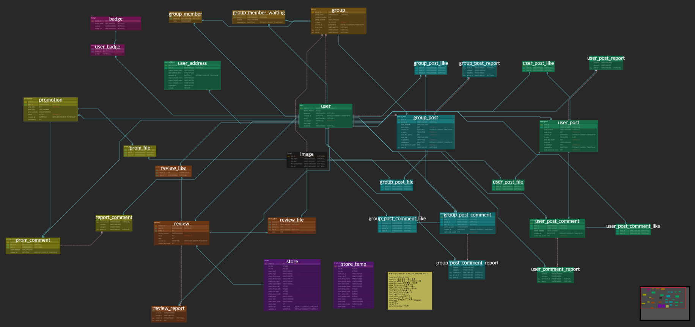
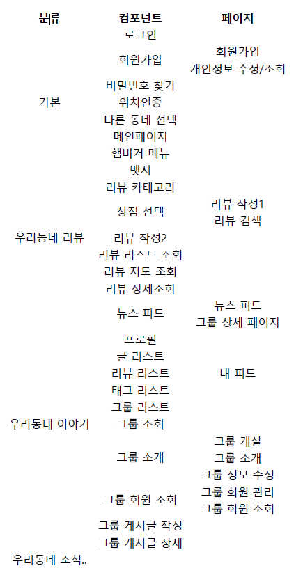

# 0120_미팅기록 - ERD

> 서울4반_4팀 2021년 1월 20일 미팅기록

---

[TOC]

---


## 공지사항

> 별도 공지 없음!

- 종원 내일(21일) 10:30 프로과 면담 일정 있음!
- :ballot_box_with_check: 내일 팀미팅은 `9:30`으로 변경 예정입니다~!!!
- :ballot_box_with_check: 변수 네이밍 규칙 정정
  - **`snake_case`**


## 주제

- ERD 및 데이터베이스 모델링 완성하기
- 상가정보 API DB 테이블 만들기


## 내용

### 1. DB 피드백 및 수정사항

> ```markdown
> ## 강용욱의 오늘의 두 마디
> - **테이블 수는 추가**되도 괜찮다! 관리에 신경:exclamation:
> - **기획은 완벽히** :heavy_exclamation_mark::heavy_exclamation_mark:
> ```

- 필드 순서도 조정해주자

**user**

- `userinfo > is_developer`를 관리자(manager)로 변경하는 것이 좋을 것 같다.
  - `role id`와 `지역 column`으로 테이블을 분리해야 할 수도 있다.
  - `is_manager`로 변경하였다.
- `동네` 테이블도 분리 (동네 순번)
  - `user_address`로 테이블을 분리하였다.
- `우편번호`로 찾기
  - 우리의 기획 방향과 맞지 않아서 반영하지 않았다.
- 위치 인증 expiration
  - 우선순위 뒤로~~~
- 닉네임을 pk로 사용
  - 닉네임은 pk로 사용하지 말 것!!! (변경되기 때문에)
  - 기존 pk를 join해서 사용한다!

**store**

> 모두 개선하였다.

- 공공데이터의 변경 추적 문제
  - store history/temp 테이블 생성하기
  - 데이터를 가지고 와서 비교를 하는 방식으로 구현해야 한다.
- `store_state = 폐점` 필드 추가
- `created_at`, `updated_at` 추가

**review**

> 개선 완료

- `review`와 `image` 1:N 수정하기
- `image` 썸네일, 사진 순서에 관련한 필드
  - 썸네일은 사용하지 않고, 첫 번째 사진이 표시되도록 한다.
- `review_like`와 `user`는 1:1관계

**group**

- `group & image`도 1:1 관계
- `그룹 승인 요청 메시지` 추가....!!!
  - 알림 기능을 
- `group id` NOT NULL 수정

**feed post**

- `group post` & `개인 post` 분리
- `post`에 `user_id` 연결하기
- `post`의 key가 더 있어야한다.
- `post > comment`에 대한 `like`

**report 기능**

- 서비스(게시판)별로 구분하는 것이 좋다!
- 신고자/피신고자
  - 피신고자는 `content`에서 join에서 가져온다.
  - 신고자 report에 담겨있다.

**뱃지**

- `badge`와 `user`를 매핑할 수 있도록
  - 새로운 테이블을 추가하여 처리한다!

*이후 추가 기능*

- 메시지 ....!!
- 우리 동네 이야기
- 공공기관과의 연계
- 민원
- 보건소 공지
- 알림/발송 기능(앱 push)
- 이모티콘 :cry:


### 2. 이야기하고 싶은 것

- 생활 패턴 존중해주기 :heavy_exclamation_mark::heavy_exclamation_mark::heavy_exclamation_mark:

  > 급한 건 `전화하기!!`

  - 송영: `일요일은 터치 no` `토요일도 쉬었으면!`, `난 이때는 연락하지 마!!!`
  - 종원: `토요일과 일요일 오전은 쉰다!`, `연락 상관 no!`
  - 진하: `주말은 늦잠 에정!`, `주기적인 산책시간(저녁시간)이 있으니 참고!`, `카톡으로 연락하기!!`
  - 규용: `새벽(12시 넘어가면) 힘들어짐 ㅠㅠ` 차라리 아침 일찍! `일주일 2-3번 헬스장 운동`, `밥은 무조건 먹기!!`, `안 될 때는 휴식 필요!!`, `연락 상관 no!`
  - 용욱: `새벽 완전 오케이~~~~~~~~!!`, `아침보다는 새벽!`, `밥 안 먹어도 열심히 일 할 수 있음!!`, `신경 끄기!`, `연락 상관 no!`
    - `이해하면서 넘어가야 하는 스타일`

- 중장기 계획

  - 파트별로 `jira` 잘 관리하기!!


### 3. ERD

> 작성한 ERD는 [ERD Cloud](https://www.erdcloud.com/d/9Kg7njtJdqG7fGB8a)에서 확인할 수 있다.

- 컨선턴트님/코치님 피드백을 바탕으로 ERD를 보완하고 개선하였다.
- `식별자관계` 및 `비식별자관계`를 명확하게 구분하였다.




### 4. 페이지정리




### 5. csv 데이터 가져오기

> 아래의 과정에서는 [공공데이터포털](https://www.data.go.kr/index.do)의 [상가(상권)정보](https://www.data.go.kr/data/15012005/fileData.do) 데이터(`csv 파일`)를 가져온다.

#### 5.1 데이터 구분하기

- 먼저 빈 `엑셀 시트`를 열어 `데이터 > 텍스트`를 클릭한다.
- 가져오고자하는 파일을 선택한 후, 인코딩 형식을 `UTF-8`로 지정한다.
- 그리고 해당 파일 데이터를 구분하는 기호(여기서는 `|(파이프라인)`)로 구분하여 해당 시트에서 표시한다.
- 해당 파일을 `csv`로 저장한다.

#### 5.2 데이터 인코딩

> 데이터 인코딩은 `메모장` 프로그램을 이용한다.

- 위에서 저장한 `csv` 파일을 `연결프로그램 > 메모장`으로 실행한다.
- `메모장`에서  `다른 이름으로 저장`을 클릭한다.
- 인코딩 형식을 `UTF-8`로 지정한다.
- :ballot_box_with_check: 이후 **반드시** 해당 파일을 본래 파일과 덮어쓰기를 하여 `txt`가 아닌 `csv`파일로 저장한다.

#### 5.3 MySQL에서 데이터 열기

> `MySQL Workbench`에서 아래의 과정을 진행한다.

- 먼저 MySQL의 Workbench를 실행하여 작업창으로 진입한다.
- `Open SQL Script` 버튼을 클릭 후 `All Files`를 찾을 수 있도록 변경한 후 가져올 `csv`파일을 선택한다.
- 해당 csv파일 데이터가 작업창에 표시되는 것을 확인할 수 있다.


## 정리

### 파트 분배

- FE - `우진하`, `이송영`
- BE - `강용욱`, `이규용`
- DB - `박종원`
  - DB 마무리 후 합류 예정
  - 공공 API 데이터 AWS 서버에 추가하기
  - ERD 필드 순서 정리


## :hand: 다음과제

:star: 내일 팀미팅에서 ERD 한 번 더 피드백 받고 수정하기!!

- **<질문사항>**
  - 필드의 `제약 조건` column에서 blank를 사용해도 되는지, 빨간색으로 표시되는 것은 그대로 처리해도 되는지?
  - 테이블에서 참조했을 때, `user_id`가 2개 생기는 문제

:star:이후 파트별로 나뉘어서 개발 계획 수립 및 개발 진행!!
