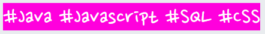
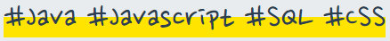

# 0216_미팅기록

> 서울4반_4팀 2021년 2월 16일 미팅기록

---

[TOC]

---


## 공지사항

> 오늘 팀미팅은 취업특강 관계로 없습니다!


## 주제

- 각자 파트별 개발 열심히 하기!

  |    이름    |             담당파트             |
  | :--------: | :------------------------------: |
  | **강용욱** |  Community 서비스 중 Group 파트  |
  | **박종원** |          Review 서비스           |
  | **이규용** | Community 서비스 중 Article 파트 |
  | **이송영** |     전체적인 CSS 및 FE 지원      |


## 내용

### 아침 Scrum

**이송영**

- 피드백 등 리뷰 페이지 세부 기능 개선 완료
- 오늘은 story 부분 css 및 세부 기능 개선 예정

**강용욱**

- 그룹 파트 여러가지

**박종원**

- AWS 새로운 키 발급 후 개설완료
- 위치인증(카카오맵) https 인증 오류 발생

**이규용**

- 마이피드 작업


### 글자에 형광펜처럼 밑줄긋기

- 먼저 다음과 같이 전체 배경색을 적용하여 효과를 줄 수 있다.



```stylus
#underline_pink {
  background-color: #FF00DD;
  color: #fff;
}
```

- 다음과 같이 형광펜 같은 밑줄 느낌의 CSS를 적용할 수도 있다.



```stylus
#underline_yellow {
  background: linear-gradient(to top, #FFE400 50%, transparent 50%);
}
```


## :hand: 다음과제

- 자세한 내용은 `jira` 참고
