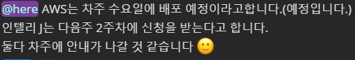
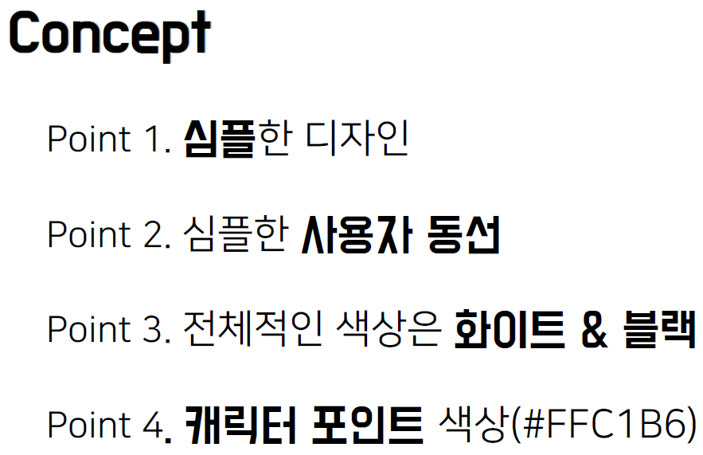
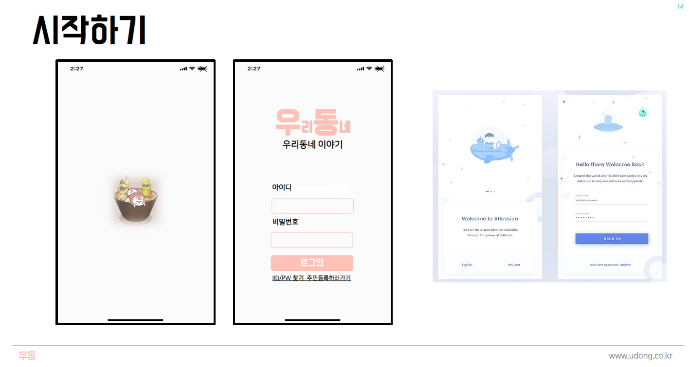
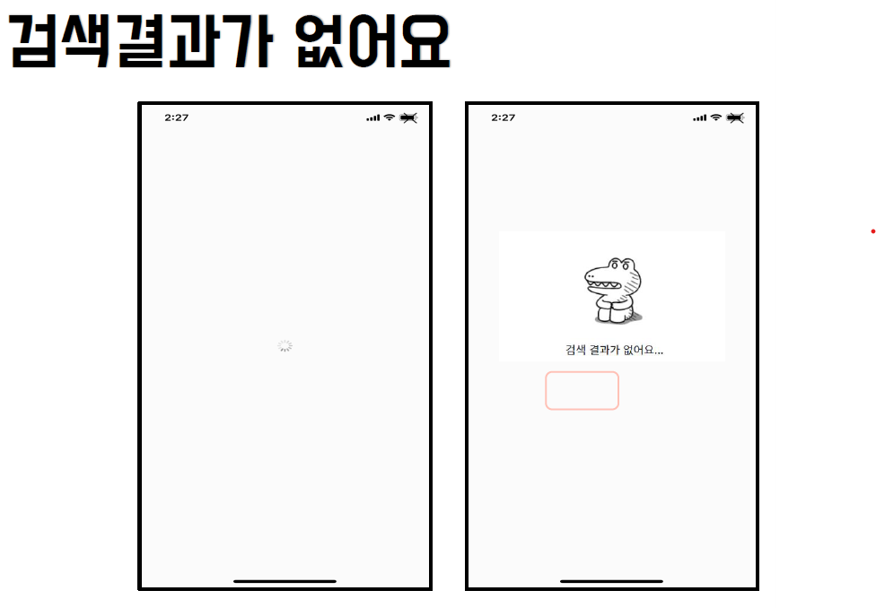
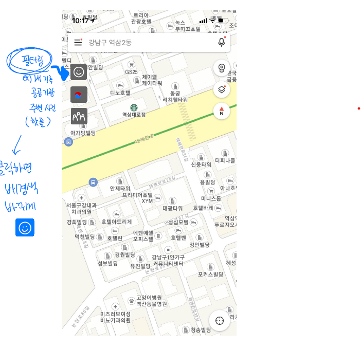
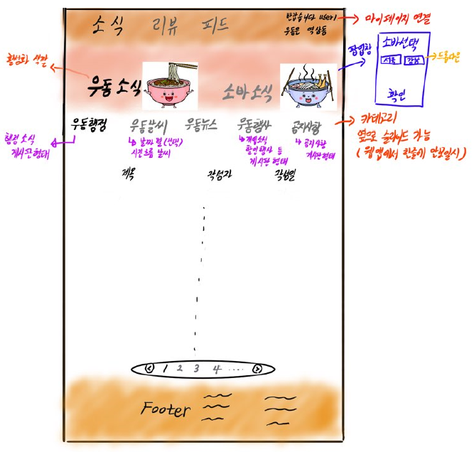
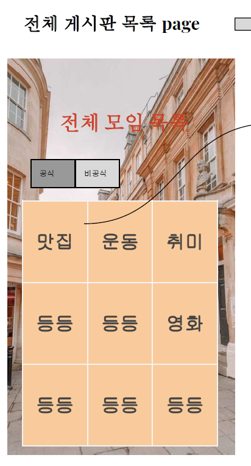
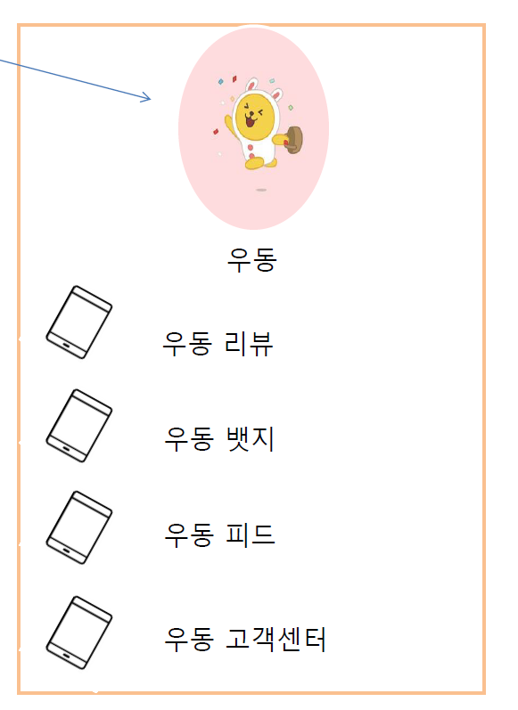
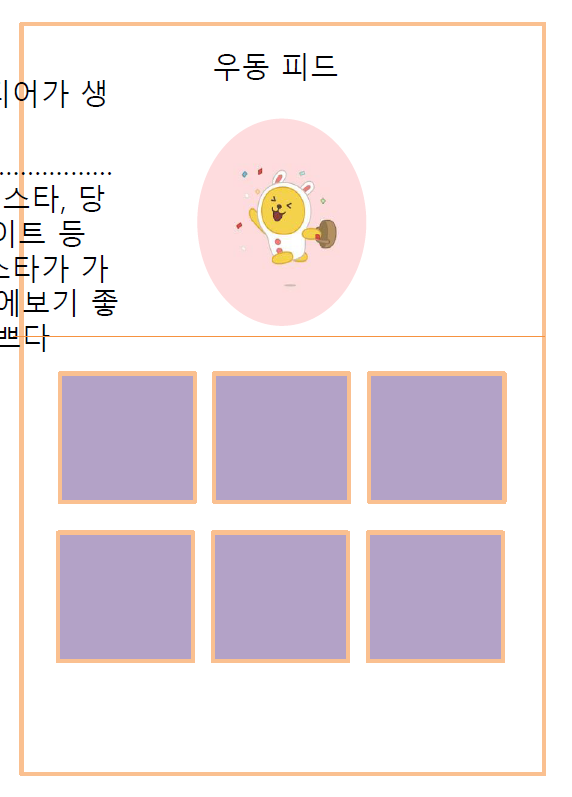
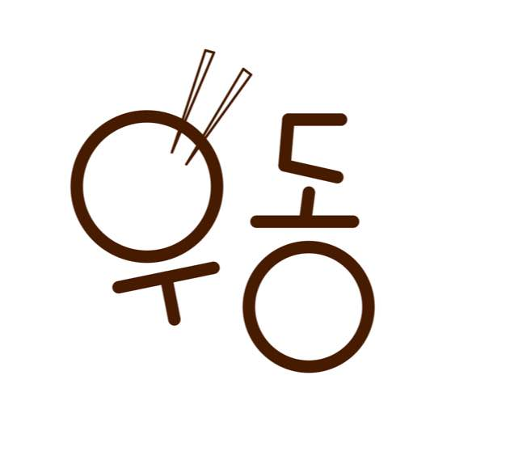

# 0114_미팅기록 - 디자인/기능

> 서울4반_4팀 2021년 1월 14일 미팅기록

---

[TOC]

---

## 공지사항

> 내일 1주차 **평가**가 있습니다!!
> 다만, 발표평가가 아닌 컨설턴트님께서 `jira`와 `git` 바탕으로 개별적으로 평가하실 예정이라고 합니다.

### 평가 일정 요약

|   주차    |                   평가 내용                   |
| :-------: | :-------------------------------------------: |
| **1주차** |          개인 평가(Jira & Git 바탕)           |
| **3주차** |                 팀별 발표평가                 |
| **4주차** | 다른 팀원들이 우리 사이트를 테스트해보고 평가 |
| **6주차** |                   최종평가                    |

### QnA

:point_right: 웹엑스 프로그램 사용시간을 기록하여 평가에 반영하나요?

- 반영하지 않으며, 팀내에서 효율성을 높일 수 있는 방법으로 자유롭게 활용하면 된다.
- <참고> 이후 웹엑스 사용시간이 높은 팀에게 시상을 할 수도 있다.

:point_right: 프로젝트 개발에서 AWS 서버를 사용하려고 하는데, 어떻게 지원받을 수 있나요?

- 다음주에 `key` 발급예정. 하지만, 완벽한 기능을 사용할 수 있을지는 미정! 또한 1대분만 지급하기 때문에, 필요하다면 12개월 사용할 수 있는 무료계정을 개인적으로 발급할 수 있도록!

- 이후 답변

  

## 주제

- 서비스/페이지별 분담하여 레이아웃과 디자인을 작성해본다. [이동](###기능별 레이아웃)
- 작성한 레이아웃과 디자인을 서로 공유하며 피드백한다.
- 기능별 구현가능성을 검토해본다. (기능정의서 작성)
- 서비스 수익구조에 대해서 더 고민해보기
- 팀 웹엑스 일정 조율하기

## 내용

### Brainstorm

|   주제   |                             설명                             |
| :------: | :----------------------------------------------------------: |
| Concept  |                      동네 + 정보(리뷰)                       |
| 거래요소 | **정보** (사용자가 늘어날 수록 규모의 경제효과와 네트워크 효과가 증폭한다.) |
| 수익구조 |                  ([이하 참고](###수익구조))                  |

### 수익구조

#### 1. 수수료

- `동네소식 > (자유)홍보` 광고수수료 받기
- `동네소식 > 뉴스`에서 지역 신문사 수수료 받기
- `동네소식 > 행정소식`에서 공공기관 수수료 받기

#### 2. 기타

- 리뷰 체험단 연계
- 쿠폰 연계
- 대학생 공모전 활용
- 비즈니스 모델 확장

### 기능별 레이아웃

#### 1. 전체 컨셉 - 이송영

전체적인 컨셉은 다음과 같다.

- 심플한 디자인을 지향한다.

- 추가적으로, 검색결과가 없는 경우 캐릭터 표시와 함께 추천 검색어를 표시하는 알고리즘을 개발한다.

#### 2. 리뷰 - 이규용

- **리뷰작성페이지**는 아래와 같다.
- `별점`을 이용하여서 직관적으로 리뷰 평가를 할 수 있는 기능을 만든다.

- 지도에서 리뷰 대상을 검색하는 경우 `필터링`할 수 있는 기능을 구현한다.

#### 3. 소식 - 우진하

- `메뉴 계층`의 구성을 아래의 그림과 같이 한다.
- 활성화 되는 메뉴는 색상을 구분할 수 있도록 디자인한다.

#### 4. 커뮤니티 - 박종원

- 커뮤니티의 `그룹`의 경우 `게시판` 형식에서 `그룹` 형식으로 변경되었다.
- 그룹을 다음과 같이 `바둑판 배열` 형식으로 표시할 수도 있다.

#### 5. 마이페이지 - 강용욱

- 메인페이지는 사이트에서 탭을 열면 확인할 수 있다.
- 탭에서는 아래와 같은 모습으로 확인할 수 있다.

- 마이페이지에서 피드를 들어갈 수 있다.

### 기능별 구현가능성

>아래의 [추가/변경되는 기능 및 서비스](####1. 추가/변경되는 기능 및 서비스), [우선순위를 뒤로 미루는 기능](####2. 우선순위를 뒤로 미루는 기능), [삭제하는 기능](####3. 삭제하는 기능) 이외에는 모두 기존의 기능들을 구현한다.
>자세한 기능들을 [구글 공유문서](https://docs.google.com/spreadsheets/d/1grVUxz6qSfn_2bLdnIeJrzDdRW30SrpIzh33N2PplIU/edit#gid=731007643)를 참조한다.

#### 1. 추가/변경되는 기능 및 서비스

**1.1 서비스 지역**

- 개발 단계에서의 서비스 지역은 멀티캠퍼스가 있는 `역삼동`을 포함해서 몇 개의 지역에서만 우선적으로 한다.

**1.2 지역 등록**

- 지역 등록은 최대 2개까지 할 수 있도록 한다. (통상적으로 거주지, 근무지)

**1.3 리뷰**

- 리뷰 리스트를 지도로 표시할 경우 `marker`를 카테고리별, 그리고 위치순/별점순으로 sorting 할 수 있는 알고리즘을 작성한다.
- [신뢰도 향상 방안] 특정개수의 추천수 이상을 받은 리뷰게시물이 특정개수 이상일 경우 `뱃지`를 발급한다. 카테고리별로 발급된 뱃지는 해당 카테고리에서 리뷰를 작성시 노출시킨다.
- 지도 API는 `카카오맵`을 사용한다.

**1.4 소식**

- `동네소식 > 개업소식`에서 업체들의 광고를 적극적으로 받는다. 이곳에는 다양한 행사 소식들도 담을 수 있도록 한다.
- `동네소식 > 자유홍보` 게시판을 만들어 사용자들이 `그룹, 스터디, 가게` 등을 자유롭게 홍보할 수 있도록 한다.

**커뮤니티**

커뮤니티는 크게 `개인 피드`와 `그룹` 이렇게 2가지로 구분한다.

- `커뮤니티` 메인페이지인 `뉴스피드`에서는 동네 사용자들의 피드 게시글, 자신이 속한 그룹의 게시글을 표시한다.

- `개인 피드`의 메인 페이지에서는 사용자가 게시한 게시물의 태그들을 모아서 보여준다.

  

- `개인 피드`에서 보여지는 태그를 선택하면, 해당 태그와 관련 있는 사용자의 게시글을 사진 형식으로 보여준다.

  

- `그룹`은 `공개/비공개` 그룹으로 구분하여 비공개 그룹 가입의 경우 `그룹 리더`의 승인을 받도록 한다.

- 그룹 생성자는 자동으로 `그룹 리더`의 권한을 가지게 된다.

- 그룹은 사용자가 생성하면 자동으로 개설하는 방식으로 개선하였다.

**1.5 뱃지**

- 뱃지는 `간지용`과 `신뢰용` 2가지로 분류한다.
- 뱃지는 취득 난이도를 다양화할 수 있도록 추후 조금 더 개선한다.
- `간지용 뱃지` - 카테고리별 뱃지, 초심자 등 처음단계에서도 쉽게 얻을 수 있는 뱃지
- `신뢰용 뱃지` - 지역뱃지 2개(인증 필요), 직업뱃지(인증 필요), 리뷰왕/맛집왕 등 카테고리별 뱃지
- `카테고리별 뱃지`는 단순 게시글 작성량 기준을 충족해야 주는 `간지용 뱃지`와 추천글 작성량 기준을 충족해야 주는 `신뢰용 뱃지`로 이원화하여 분류한다.

**1.6 캐릭터**

- `우동`의 캐릭터를 이미지 대신 로고로 형상화한다.
- [피드백 부분](##피드백) 참조

#### 2. 우선순위를 뒤로 미루는 기능

- `커뮤니티` 메인 페이지인 `뉴스피드`에서의 `지역 범위설정 = 4`에서 우선 `지역 범위설정 = 1`로 개발한다.
- `간편 로그인(소셜로그인)` 기능

#### 3. 삭제하는 기능

- 방문체크 기능
- `커뮤니티 > 개인피드` 중 `인물 사진(얼굴이 감지된 사진)`의 게시글을 `뉴스피드`에 노출하지 않는 기능
- `경험치 기능` - `뱃지 기능`에 포함하여 단일화 및 뱃지 기능을 강화한다.

### 웹엑스  일정 조율

- 식사시간을 넉넉하게 할 수 있으면 좋겠다라는 의견
- 점심시간을 **`11:40 - 13:10`**으로 조정!

## 피드백

:ballot_box_with_check: 별점을 우동 관련 요소로 사용하게 되면 사용자들이 이해하기 어려울 수도 있다.

- :point_right: `우동`의 캐릭터를 이미지 대신 로고로 형상화한다.

  

:ballot_box_with_check: 관리자가 해야할 일들이 많다.

- :point_right: `게시판 생성 자동화` , `신고제도` 등 기존 관리자가에게 맡겼던 일들을 자동화하거나 사용자의 재량을 넓혀줌으로써 개선한다.

:ballot_box_with_check:리뷰 게시글이 많을수록 좋은데, `리뷰 지우기`가 너무 쉽다.

- :point_right: 게시글 삭제, 회원탈퇴 등과 같은 기능들은 `넛지(nudge)`를 활용하게 사용자가 불편할 수 있 있도록 바꿔준다.

:ballot_box_with_check: SNS/리뷰의 개방성 및 신뢰성/프라이버시 문제에서의 폐쇄성 사이에서 커뮤니티가 지향하는 가치에 따라 밸런스가 필요하다.

- :point_right: `내 리뷰 숨기기` 기능에 대해서는 추후 다시 의논해본다.
- :point_right: `방문체크` 등 폐쇄성 요소들은 사용자의 편의성 증진을 위해서 `뱃지 기능 강화` 등으로 개선하였다.

## 정리

- 기능을 조금 더 구체화하였다.
- 디자인 및 DB 개발 단계에서 구현할 기능을 다시 한 번 더 검토할 수 있도록 한다.

## :hand: 다음과제

### 내일 할일

- :star: 내일은 3명/2명 팀을 나누어서 페이지 레이아웃 디자인과 DB 작성 작업을 한다.
  - 디자인팀 - 규용, 송영, 진하
  - DB팀 - 종원, 용욱
- :star: ​이후 팀별로 발표를 하고 피드백을 하며 개선점을 논의한다.
- :star: 디자인 작업이 마치면 모든 팀원들이 DB 작성 작업을 함께한다.

### 의논할 점

- :heavy_check_mark: 서비스지역 - 4주차 다른 팀 테스트 평가에서 문제가 될 수 있다.

- :heavy_check_mark: `그룹 리더` 위임 가능하게 할 것인지?