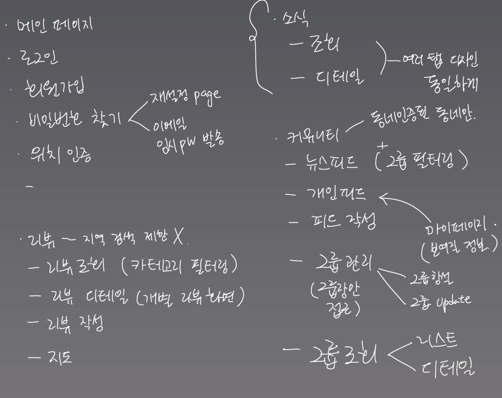
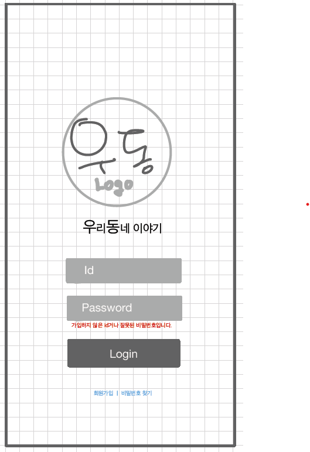
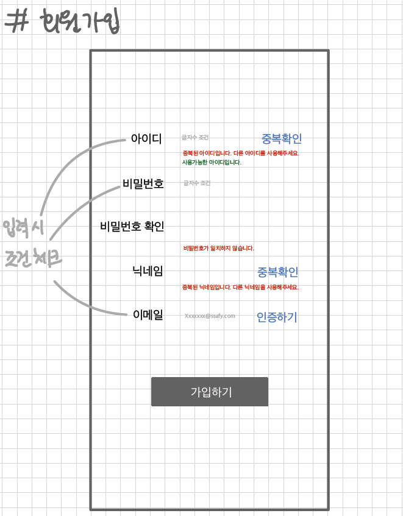
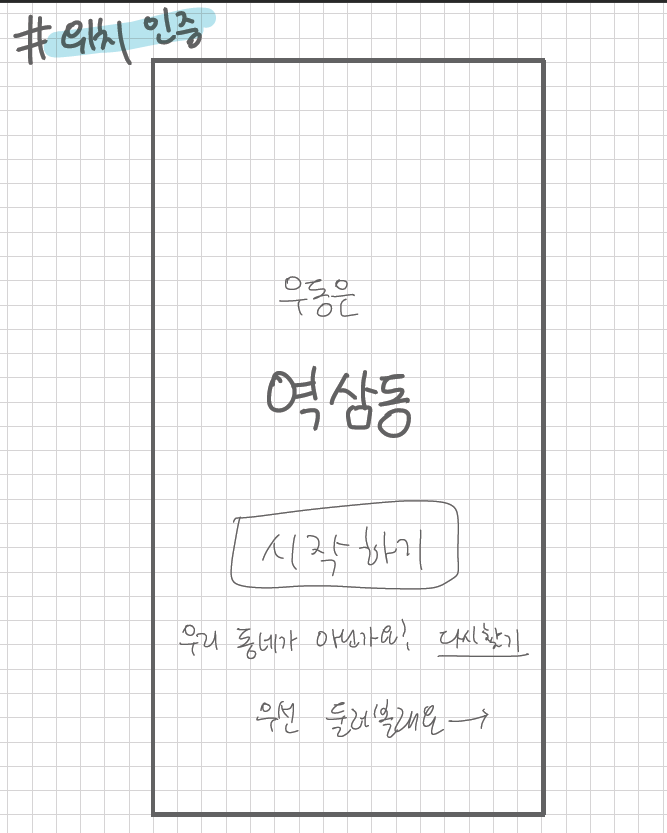
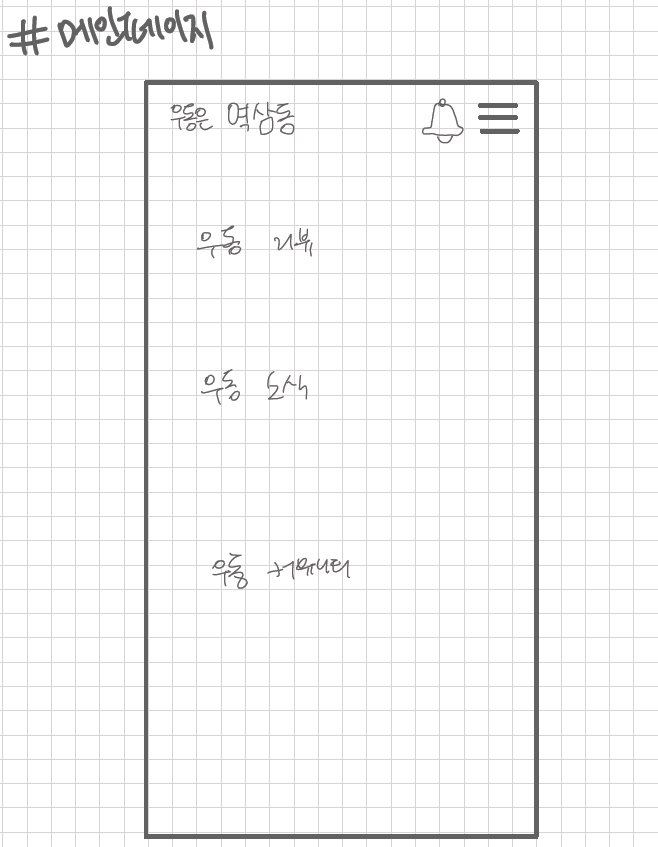
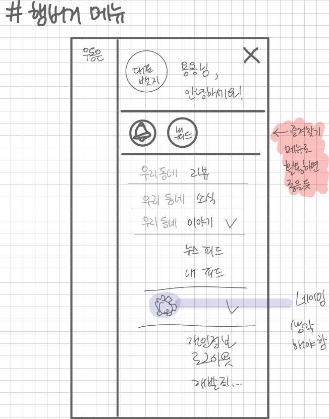
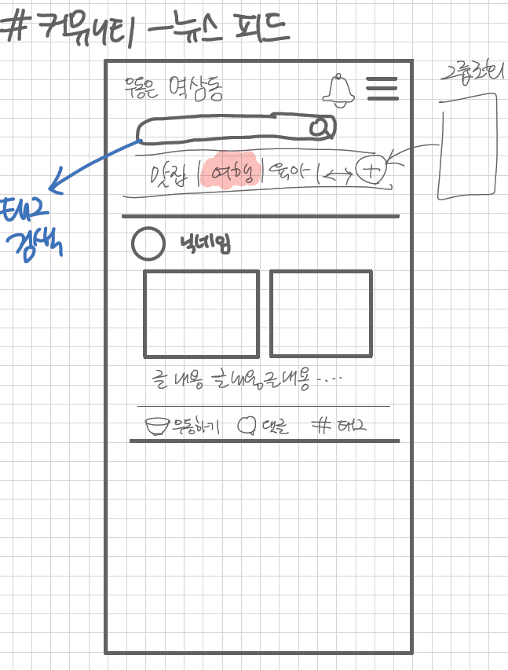
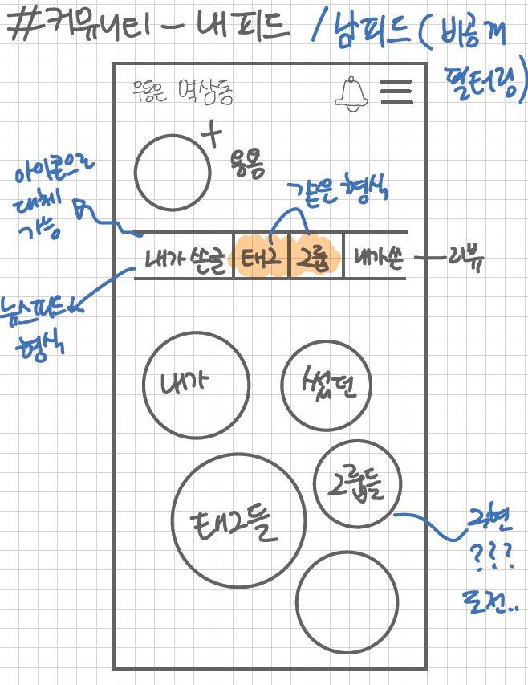
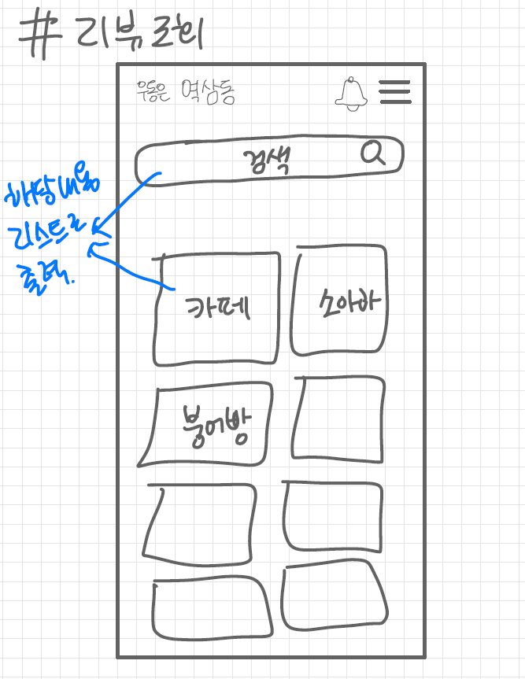
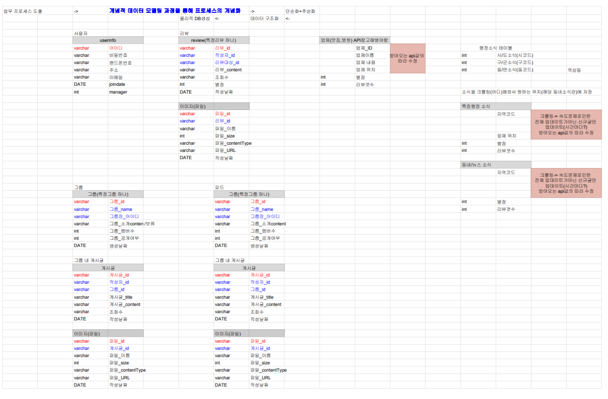

# 0115_미팅기록 - 와이어프레임/DB

> 서울4반_4팀 2021년 1월 15일 미팅기록

---

[TOC]

---


## 공지사항

> 오늘은 14시 - 16시에 팀내 평가가 있습니다. :exclamation:

- 팀내 평가는 MM에 올려준 자료를 기반으로 팀원들 상호평가 하시면 됩니다~!
- 오늘 17시 종료 미팅은 없습니다!
- :ballot_box_with_check: 월요일에는 **9시에 바로 오전 미팅**이 진행되고, **17시부터 라이브 방송 및 종례 미팅**을 진행할 예정이니 일정에 착오 없으시길 바랍니다! :smile:
- 1/19(화) 9:30 `강용욱` 프로님과 개인면담
- 모두모두모두 오늘 너무 수고하셨습니다 :exclamation::exclamation:


## 주제

1. 페이지별 와이어프레임을 작성한다.
2. 프로젝트 서비스에 필요한 데이터베이스를 설계한다.


## 내용

### 1. Wireframe

> 1월 15일 작성한 와이어프레임은 다음 [파일](proposals/0115_와이어프레임.pdf)

:ballot_box_with_check: `리뷰` 서비스 추후 작업 필요

구현해야하는 페이지들은 다음과 같다.




#### 1.1 로그인



#### 1.2 회원가입



#### 1.3 위치 인증



#### 1.4 메인페이지



#### 1.5 모바일 메뉴탭



#### 1.6 뉴스 피드



#### 1.7 내 피드



#### 1.8 리뷰 조회




### 2. 데이터베이스

> 1월 15일 작성한 데이터베이스는 다음 [파일](proposals/0115_공통프로젝트DB.pdf)을 참고한다.

:ballot_box_with_check: `소식` 서비스 추후 보완 필요




## 정리

- 금일 개발 서비스의 `와이어프레임` 및 `데이터베이스`를 작성해보았다.
- 서비스를 구체화시키다보니 `기간 내 실현가능성`에 대해서 재논의하게 되었다.
- 따라서 주말동안 각자 고민해본 후, 위 안건에 대해서는 월요일 오전에 충분히 다시 토론해보기로 하였다.
- 또한, 주말기간 동안 `개발환경`을 정리하여 월요일에 함께 `개발환경구축`을 할 예정이다.


## :hand: 다음과제

:star: **기획 방향 재논의** - 차별점/특화 등의 사항에서

:star: **개발환경 구축** - `강용욱`` 팀원이 일요일 개발환경구축 후, 월요일 팀원들과 공유 예정


## 느낀점

오늘 모두모두 너무 수고하셨습니다!

```markdown
DB 설계도를 봐도 엄청 세심하게 게획하며 고민한 흔적이 보이고
또 다소 추상적이던 UI 및 기능들을 계속해서 의견을 교환하면서 구체화하고 디자인하는 과정도 있었고
다른 의견, 불편한/어려운 점, 기획 방향조차 재정립하는 이야기들을 침묵하지 않고 서로 거림낌 없이 이야기하던 과정도
모두 팀원 서로간 존중하며 책임감도 가지고 있으며 건강한 팀인 것 같다는 생각이 들었다.
기획 프로젝트를 많이 해봐서 어렵지는 않을 것이라 생각했지만 실제로 부딪혀보니 생각보다 필요한 배경지식이나 간과하고 있던 부분들이 많았음을 깨닫게 되었다. 어떤 방향으로 나아갈지 근시안에서 몇 발자국 뒤로 물러나 크게 보기에는 아직까지 이 부분의 역량이 조금 부족한 것 같아 아쉬움이 들기도 한다. 멀리서 보아야 비록 선명해지는 것처럼 현재에는 잠시 더뎌지는 것 같고 혼란스러움으로만 보이는 것도 재미와 확신이 있다면 후에는 반드시 명확해질 것이라고 생각한다. 
```

