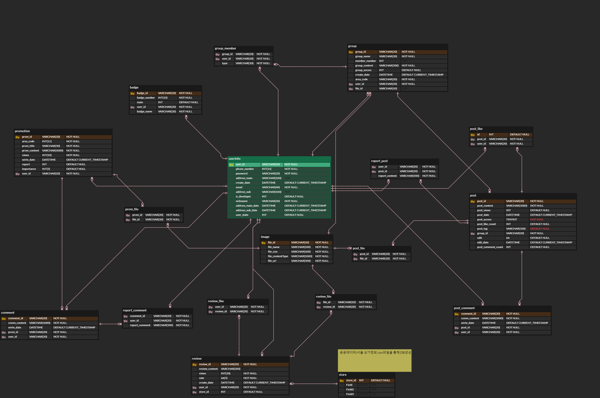
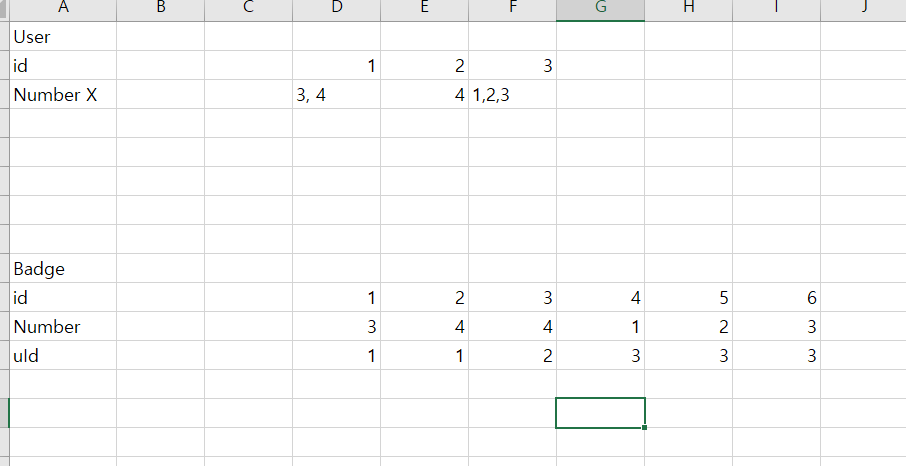
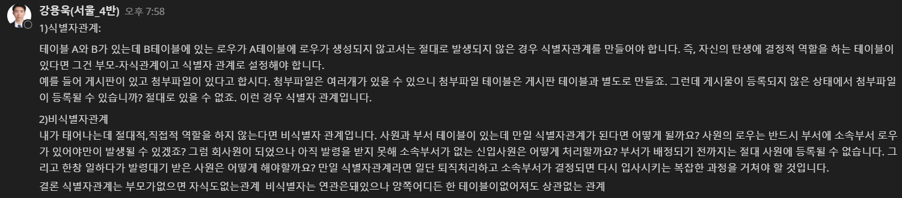

# 0119_미팅기록 - 와이어프레임/ERD 보완

> 서울4반_4팀 2021년 1월 19일 미팅기록

---

[TOC]

---

## 공지사항

> 오늘 늦은 시간까지 모두 너무너무 수고하셨습니다~~~!!!!!!!!!!!!:exclamation:

- 오늘 팀미팅 시 `화면설계`, `DB설계` 위주로 리뷰할 예정이라고 합니다!
- :star: 내일 `아침 10시반`에 팀미팅 예정!!
  - 데이터베이스 ERD 리뷰할 예정입니다~!

## 주제

1. 데이터베이스를 검토한다.
   - [DB 링크](https://docs.google.com/spreadsheets/d/1DZ8YnjyE82DVMcvgV5fPHP5Tc-EhFy-Fp7AQqUGQaqA/edit)에서 엑셀 파일에 초안으로 작성한 DB 설계를 확인할 수 있다.
2. 팀미팅 발표 자료로 활용할 와이어프레임을 정리한다.
   - [발표자료](0119_와이어프레임_발표자료.pdf) 참고
3. 개발파트를 배분한다.
4. 이에 따른 skeleton 코드를 작성한다.
5. 팀프로젝트 네이밍규칙을 정한다.

## 내용

### 1. 역할 배분

- `Front-end`: `우진하`, `이송영` + `박종원`
- `Back-end`: `강용욱`, `이규용`
  - `CRUD`를 먼저 작성한다.

### 2. 네이밍 규칙

- 변수 네이밍은 `camelCase`로 작성한다.

### 3. 와이어 프레임

> 와이어 프레임 최종본은 [와이어 프레임](210119_Ui_와이어프레임.pdf)을 참조하면 된다.

**피드백 및 수정**

- `위치 인증`을 하지 않을 경우 자신의 지역을 직접 선택할 수 있게 해주면 좋겠다.
  - `위치인증 동네 & 위치인증 여부`는 front에서 작업한다 !
  - :ballot_box_with_check: 대표동네인증(2개)은 `설정`에서 관리한다. 
  - :ballot_box_with_check: `우동은 역삼동`을 클릭하면 `우리동네1`, `우리동네2`, `다른 동네 찾기`를 띄워준다.
- `햄버거 > 즐겨찾기`는 필요 없을  수도 있을 것 같다.
  - `햄버거 > 즐켜찾기`는 제거한다.
- `리뷰 대상 검색` 시 현재 위치 기준으로부터 거리도 표시해주면 좋을 것 같다.
  - 채택!
- `내 피드 > 태그`는 [워드 클라우드](http://wordcloud.kr/)를 사용하면 좋을 것 같다.
  - 개발 과정에서 참고한다!
- `내가 쓴글`, `내가 쓴 리뷰`, `태그`, `그룹`의 순서로 탭을 만들면 좋을 것 같다.
  - 수정 완료!
- 회원정보 수정, 뱃지
  - 와이어프레임 제작 완료!

### 4. DB 피드백

- `ERD Cloud`라는 툴을 이용하여 DB의 ERD를 아래와 같이 작성하였다.

**피드백 및 수정**

- DB 생성은 [ERD Cloud](https://www.erdcloud.com/) 사용하기

- `뱃지 DB`는 `cloumn` 대신 `row`로 늘리는 것이 맞을 것이다.

  - 김명석 코치님 뱃지 DB 예시

  

## 정리

- 내일 팀미팅에서 `ERD`에 대한 피드백을 받아서 참고/보완 후 데이터베이스 모델링을 완료한다.

- 오늘의 학습내용 - `식별자 관계`에 대하여

  

## :hand: 다음과제

:star: 오전 10:30 팀미팅

- 질문거리
  - :ballot_box_with_check: 위치 인증 expiration 어떻게 해결할 수 있을지?
  - :ballot_box_with_check: `DB > UserInfo > 닉네임`을 모델의 pk로 사용할지 혹은 join을 해서 사용할지?

:star: ERD 및 데이터베이스 모델링 완성

:star: 개발 시작
