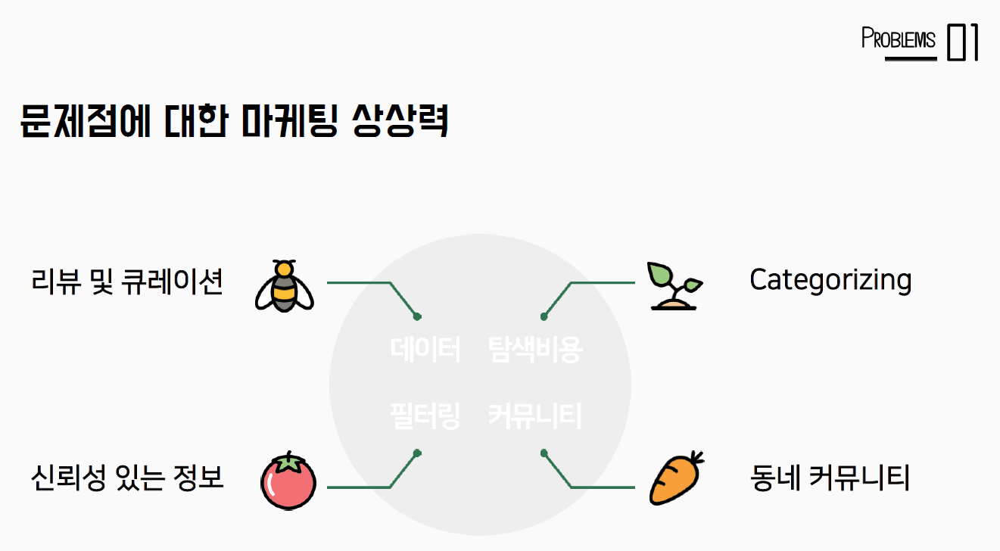
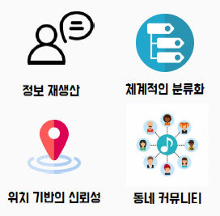

# UCC 구성

---

[TOC]

---

## 1. 개요

1. 인트로 광고 - 우동~ 우동~ 우동~ (5s)
2. 우동이 필요한 예시 (15s)밥먹자! 카톡 보내는 영상 -> 리뷰 참고해서 여기 가보자~~~우리동네... 쓸데 없는 소식... 알려주고싶은데 알려줄 곳이 없어!붕어빵, 눈 왔다, 보도블럭 깨졌어요!
3. 서비스 소개 - 간략하게 이미지적으로.... (20s) **구성 방향은 다시 생각해야함**이미지/피피티로 3가지 핵심 기능(우리 동네 제한, 리뷰, 커뮤니티) 강조EX) 진짜 동네 주민의 리뷰, 우리 동네 사는 소식 궁금해, 우리 동네 사람들과 소통하고 싶어...!들어가야할 내용what? 우동who? 지역(동 단위) 내 사람들why? 지역 SNS가 쓸만한게 없음how? 웹으로when? 아무때나..
4. 시장분석 & 타깃 사용자(20s)
5. 서비스 시연 영상(2m 30s)UCC 서비스 시연 순서 참고 - 뒤에 더 쓰기중간중간 중간 광고 느낌으로 우동이 끝내줘요 넣기!
6. 아우트로(40s)프로젝트 구성(Vuex, Spring, MariaDB) (15s)개발진 소개 (25s):point_right: 예상 소요시간 4분 10초~


## 2. 스토리

### 2.1 서비스 기획의도

- **#** 카카오톡 메시지 주고 받는 장면

  - 시나리오 1

    ```markdown
    A 야 저녁 뭐 시켜놓을까?
    B 피자 먹자! 
    B 오피피자 어때?
    A 아니 거기 못들었어? 별로래ㅋㅋㅋㅋ
    B 엥 거기 평점 엄청 좋던데 아니야?
    A 그거 광고였나봐
    A 우동에서 확인해보니깐 안 좋더라고
    B 우동?
    A 아 있어~! 
    A 우리동네라고 동네 주민들이 리뷰 쓰는 사이트인데 거기 찐이야
    ```

  - 시나리오 2

    ```markdown
    A 야 있잖아 ㅠㅠㅠ
    B 웅 ㅋㅋㅋㅋ
    A 요새 코로나 때문에 계속 집에만 있는데
    A 진짜 여기가 우리 동네였는지
    A 밥도 뭐먹어야할지 모르겠고 아무것도 모르겠다 ㅠㅠㅠ
    B 아
    B 나도 요새 느낀게
    B 집 앞 편의점은 맨날 가봤지
    B 마트가 어디있는지도 모르겠더라 ㅋㅋㅋㅋㅋ
    A 하 진짜 ㅋㅋㅋ
    ```

- 일생에서의 다양한 문제점 포착 (띄우고만 넘어가도 됨)

  

- `지역 연결`과 `리뷰/정보`로 **"우동"이라는 동네 정보 기반 커뮤니티 공간**을 기획하게 되었다.

- 그리고 아래의 가치를 통해서 소비자들이 신뢰성 있는 정보에 쉽게 접근할 수 있게 하며, 동네 사람들과의 커뮤니티가 활성화될 수 있는 효과를 기대한다.



- 그리고 이 서비스를 지금 만나보시겠습니다~!!!


### 2.2 서비스 시연 순서

1. 로그인(5s)**로그인할 때마다 동네를 선택합니다.**로그인 안 되는 경우에 대비하여 역삼동으로 갈게요 있음
2. 메인 페이지(10s)동네 선택 가능 -> **다른 동네 구경 가능****리뷰, 동네(행정)소식, 커뮤니티 3가지 기능**============================================================================
3. 리뷰(30s)**시스템 추천 카테고리** 제시리뷰 많은 순으로 인기 많은 상점 추천해서 보여줌리뷰 검색(15s)**편의점, 카페, 치과, 책, 떡볶이** 등하나 말할 때마다 검색해서 결과 뜨는거 빨리감기해서 보여주기**관련 검색어 등으로 검색 가능**검색한 결과 중 하나 선택해서 리뷰 작성 클릭리뷰 작성(15s)검색에서 바로 연결해서 보여줘야 함리뷰 작성하는 모습 빠르게 보여주고 사진 첨부도 해서 등록.바로 작성한 리뷰 페이지로 넘어가야 함.**우리 동네 것만 가능**===========================================================================
4. 커뮤니티(25s)**커뮤니티는 동네 사람들만의 공간**개방성 + 폐쇄성 <- 이거 워딩 바꾸는게 좋을 듯바로 게시글 작성하는 페이지로 넘어가서설명하면서 빠르게 작성하는 모습 보여주기 - '우리동네 이야기'로**우리동네 이야기와 자신이 가입한 그룹 중 선택해서 글을 작성할 수 있습니다.**
5. 커뮤니티 - 우리동네 이야기(10s)**동네의 모든 사람들에게 보여집니다.**3에서 작성한 게시글이 바로 뜨는거 보여주기화면 내용 보여줄 거 비면더보기 누르면 게시글이 더 로드 됨댓글 누르면 댓글 수 나오고더보기 누르면 댓글 더 선택 가능좋아요도 가능댓글도 좋아요 가능===========================================================================
6. 커뮤니티 - 그룹 게시물(15s)그룹을 선택하고 작성한 게시글을 볼 수 있는 공간그룹 여러개 바꿔서 보여주기**그룹에 작성된 게시글은 그룹원들만 조회 가능합니다.**
7. 그룹(20s)**그룹은 승인필요/ 불필요 그룹으로 나뉨****이미 친분이 있는 친구, 이웃들과 이야기를 나누거나**ex) 그룹명: 햇님반 학부모 모임, 해피홈 102동 모임,**새로운 동호회를 만들 수도 있음**ex) 그룹명: 역삼동 소믈리에, 매일요가수련, 육아고민수다, ...===========================================================================
8. 유저 정보(25s)
   - 송영오빠 피드백) * 추억, 감성 관련한 언급이 필요할 듯
   - 유저가 작성한 게시글, 리뷰, 작성한 태그, 가입한 그룹 등을 **조회**할 수 잇음
   - 모든 유저에게 이 정보가 공개되므로 **해당 유저가 쓴 게시글의 신뢰성을 다른 유저가 판단할 수 있음**
   - **동네에 게시글을 많이 쓰거나, 리뷰를 많이 쓰는 등 활동을 하면 뱃지 부여** - 이걸로도 **신뢰성 판단**
9. 소식...

:point_right: 2분 10초 ~ 2분 30초 나올 듯