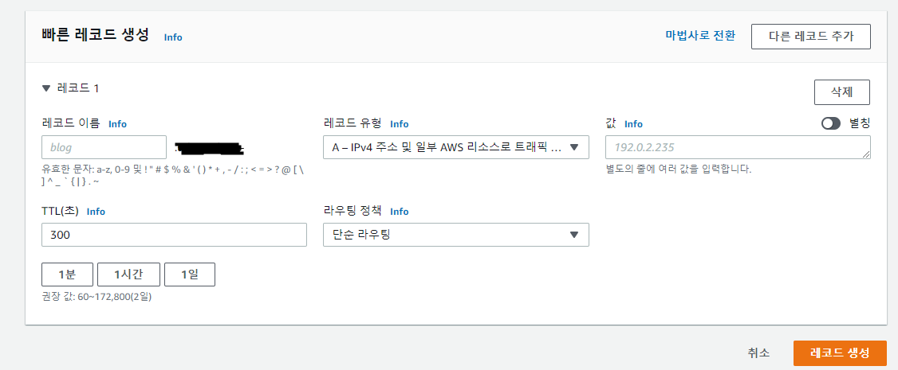

AWS로 스프링프로젝트 배포하기(도메인구입)

-서울캠퍼스 박종원

[TOC]

전체적인 과정을 나누면

1. AWS가입 
2. 도메인 얻기 (구입 OR 무료도메인) -> 나는 가비아에서 구매!
3. https를 사용하기위해서는 도메인에 대한 ssl인증 받기(aws에서 인증)
4. aws -> Route 53 콘솔(호스팅영역)을 통해 구입한 도메인과 aws인스턴스를 연결하기.
5. 로드밸런서를 생성준다(https를 쓰실 분 들만 )
6. Route 53 콘솔(호스팅영역)을 통해 도메인을 elb와 연결한다!
7. 도메인으로 접속해본다 끝

시작하기 전에

왜 굳이 위의 과정을 거쳐야하나?

우리 프로젝트에 있는 geolocation기능은 보안문제 때문에 크롬 특정버전 이후로부터는 

http환경에서사용 할 수 없습니다.

하지만 기능을 포기할 순 없으니 https로 개설하여 기능을 적용시켜 봅니다.

이를 위해서는 aws의 콘솔들을 사용해야하니 aws에 가입해야 합니다.

1. aws가입

해외 결제가능한 카드를 이용하여 가입하세요.

aws의 자기 정보가 밖에 노출 되면, 외국형님들의 비트코인채굴에 내 서버가 이용당해서

요금 몇백만원 나올수도 있습니다. 항상 보안에 신경쓰세요

2. 도메인 얻기

[가비아]

가비아라는 사이트를 들어가서 회원가입을 한 후,

검색창에 원하는 키워드를 넣고 가격대가 적당한 도메인을 결제한다.

단기프로젝트를 위해서는 1년짜리로 구매하고, https를 사용하실분들은 가비아 네임서버(ns)가

아닌 외부 네임서버(ns)를 선택하도록 한다.

3. ssl 인증받기

AWS로 넘어가서 

AWS에 로그인한 후 Certificate Manager콘솔로 이동한다.

AWS 리전을 꼭 확인하시기 바랍니다. 해당서비스가 제공될 지역에서 인증을 받아야한다!

인증서 요청 버튼을 눌러주세요!

공인인증서 요청이 디폴트값으로 되어있을텐데 놔두고 인증서 요청 클릭
[인증받기위한 화면]

내 도메인 이름을 넣고 다음을 눌러주세요!

여기서 내 도메인이 udong.shop 이라면 이 주소는 당연히 넣어야하고

이 인증서에 다른 이름 추가버튼을 누르고

*.udong.shop 을 추가해준다.

여기서 *.을 앞에 붙이는 이유는 ssl인증서의 유효범위가 

udong.shop뿐만 아니라 www.udong.shop, ssafy.udong.shop 다 적용 시키기 위함이다.

[사진사진]]

마지막으로 확인 및 요청을 누르면 

도메인 이름 옆에 이름 유형 값이 3개가 뜨는데 이것을 가지고

가비아롣 돌아가서

내 도메인의 DNS설정 들어가서 입력해주면 됩니다!

꼭 3가지를 다 넣어줘야합니다.(cname같은 경우 자료형이니 선택해준다)

이 과정을 하게 되면 내가 구입한 도메인의 DNS를 ASW에서 인식 할 수 있게 되고,

토대로 SSL인증이 이루어지게 됩니다.

자 여기서 ssl인증이 바로 이루어지는 것이 아니라 검증보류상태로 남아있게 되는데요,

30분정도 넉넉하게 기다려주면 알아서 발급완료로 전환됩니다.

이렇게 내가 구입한 도메인에 대한 ssl인증이 이루어졌습니다!

4. Route 53을 이용하여 DNS에 도메인 등록

도메인 이름이 있어도 그 도메인 주소가 컴퓨터가 이해할 수 있는 실제 주소인 IP와 매칭이 되지 않으면 위치를 알 수 없습니다. 

도메인 주소 <=> IP 간의 맵은 DNS(Domain Name Server)가 가지고 있으며, 

도메인이 DNS에 등록이 되어있어야 도메인 주소로 직접 접근이 가능합니다.

AWS Route 53은 도메인을 호스팅할 수 있도록 도와줍니다.

AWS Route 53 콘솔로 이동합니다.

왼쪽 대시보드에서 호스팅 영역을 클릭합니다.

호스팅 영역 생성을 클릭합니다.

내가 구입한 도메인의 주소 ex)udong.shop을 입력해주고

설명을 그냥 스킾하고 생성을 해줍시다.

생성하게되면 내 도메인 이름 옆 ns라는 값에 4개의 url이 보이게 될 텐데,

이제 이걸 가지고 다시 가비아로 돌아가야합니다.

가비아로 와서, 내 도메인을 관리하는 탭에 들어간다음

네임서버(ns)을 수정해줍니다.

여기서 1,2,3,4,5,6 .. 여러개가 있는데 1,2,3,4에 aws에서 가져온 url을 넣어줍니다.

여기서 여러 url을 정해주는 이유는, 한곳이 막히면 다른 곳으로 쓰기 위해 일종의

예비주소를 설정한다고 생각하시면 됩니다.

5. 로드밸런서를 생성준다(https를 쓰실 분 들만 )

AWS에 접속한 뒤 EC2 콘솔로 이동합니다.

왼쪽에 탭이 있을 것입니다. 아래로 내려가서 로드밸런서라는 항목을 클릭해줍니다.

로드밸런서 생성을 클릭해줍니다.

로드밸런서 유형에서

우리는 https환경을 만들기 위함이니, http https로 생성해줍니다.

이름은 그냥 내가 알아볼 이름으로 정해주고,

디폴트로 되어있는 http 를 https로 꼭 변경해줘야합니다.

가용영역을 최소 2개이상 체크해주고 다음: 보안 설정 구성을 클릭해 넘어갑니다.

위에서 SSL 인증서를 발급 받는 과정을 진행했다면 인증서를 고를 수 있을 것입니다.

인증서가 목록에 없다면, 처음으로 돌아가서 인증서 얻기 부터 진행해주세요

이제 인증서를 고르는 탭에 왔습니다!

우리가 어렵게 만든 인증서를 클릭해주시고 다음으로 넘어갑시다.

보안그룹을 정하는 탭인데요,

우리는 새 보안그룹을 생성하겠습니다. 새 보안 그룹 생성 동그라미에 체크하면, 

아래와 같이 자동으로 입력이 되어있을 것입니다. 

이 상태 그대로 다음: 라우팅 구성을 클릭합니다.

대상 그룹의 이름을 입력해 줍니다. 대상 그룹이라 함은 

ELB를 지나서 도달해야하는 대상들의 묶음입니다

(ELB를 통해서 도달할 EC2를 이 대상 그룹에 넣어줄 것 입니다).

프로토콜과 포트는 웹서버가 사용하는 프로토콜과 포트를 씁니다.

제 웹서버는 http로 그리고 8000번 포트를 사용하게 만들어져 있으므로 

유형은 인스턴스, 프로토콜은 http 포트는 8000을 사용했습니다.

/elb인스턴스등록.png)

위에서 만든 대상그룹에 대상을 등록해주어야합니다.

ec2 instance가 만들어져있다는 것을 전제로 할 때, 검은 박스 부분에 인스턴스가 존재할 것입니다. 

왼쪽에 체크를 하고 등록된 항목에 추가를 누르면 추가됩니다.

추가되면 위에 내 인스턴스가 올라가게됩니다.

확인되었으면 다음을 클릭합시다!

마지막으로, 입력한 것들을 다시 한번 검토한 후 생성 버튼을 누릅니다.

위의 과정을 잘 따라오셨다면,

다음과같이 로드밸런서가 생성 될겁니다!

이제 로드밸런서 목록에서,

provisioning이 조금기다리다가 새로고침하면 active로 바뀌게되는데, 그 때부터 ELB가 적용됩니다.

6. Route 53 콘솔(호스팅영역)을 통해 도메인을 elb와 연결한다!

이제 정말 다왔습니다. 제일 중요한 과정을 해주어야합니다.

바로 내가 구입한 도메인과 elb를 연결시켜주는겁니다!

호스팅영역 기억나실겁니다.

aws의 Route 53 콘솔로 들어가서 호스팅영역을 눌러줍시다.

내가 구입했던 ex)udong.shop 도메인이름을 클릭하고

레코드생성을 눌러줍시다.

그럼 이와같은 입력탭이 뜨는데요, 여기서 레코드이름에는

이미 구입했던 도메인이 .뒤에 있을겁니다.

자기가 www를 쓰고싶으면 www를 붙여주고, ssafy를 쓰고싶으면 ssafy를 붙여줍니다.

그렇게 되면 www.udong.shop 또는 ssafy.udong.shop로도 접속이 가능합니다.

그리고 가장 중요한것!!

레코드 유형을 디폴트값 그대로 두시고

값에 별칭을 on하시고, 서울을 클릭하시면

내가 아까 만든 elb가 나올겁니다!

그것을 클릭하여 적용해줍니다.

그리고 레코드를 생성을 완료 해주시면 됩니다.

10분정도 기다리면 정상적으로 등록이 완료됩니다.

putty또는 mobaxterm을 이용해 ec2로 열어놓은 중이라면, 접속이 될겁니다!

(포트번호안 붙여도 됩니다. 아까 elb생성할때 적어줬으니).

DNS에 등록이 되었는지 확인하는 방법.

test.com = 자기가 구입한 도메인

운영체제가 Windows인 경우, cmd를 열어서 nslookup test.com

Mac OS or Linux인 경우, terminal을 열어서 nslookup test.com

끝!

