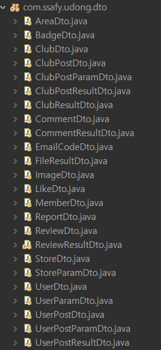

# 우리동네(UDONG)

---

[TOC]

---


## Intro

> 2021년 SSAFY 2학기 공통프로젝트로 `우리동네`라는 커뮤니티를 개발하였다.
>
> 개발기간: 2021년 1월 11일 - 2021년 2얼 19일

### Service

- 동네 사람들을 연결하는 커뮤니티 기능을 제공한다.
- In this service, users can be connected with their neighbours.
- 위치 인증 방식으로 신뢰도 높은 리뷰 서비스를 제공한다.
- With location-based authentication system, users can access reviews of highly elevated reliability.
- 사용자들은 동네 이야기 및 정보를 효과적으로 공유할 수 있다.
- Users can share stories and information of town effectively with each other.

### Compatibility

- `openjdk 11.0.9.1`, `npm 6.14.10`, `vue/cli 4.5.19` 버전에서 테스트되었다.
- We tested the code using `openjdk 11.0.9.1`, `npm 6.14.10`, `vue/cli 4.5.19`.
- 데이터베이스는 `MySQL 8.0.22`에서 작성되었다.
- We created database using `MySQL 8.0.22`
- AWS EC2를 이용하여 프로젝트를 서버에 배포하였다.
- We deployed project using AWS EC2.


## 설치 안내

> `git clone`을 한 후 아래의 작업을 진행해야 프론트 서버를 실행할 수 있다.

**1단계: npm 설치**

- `frontend` 프로젝트 폴더에서 npm을 설치한다.

```bash
npm install
```

**2단계: 환경변수 설정**

- `frontend` 폴더 내의 최상위 창에서 환경변수 `.env.local`이라는 파일을 생성한다.

- 환경변수로 관리하는 데이터는 다음과 같다.

  ```markdown
  ## .env.local
  
  VUE_APP_SERVER_URL=<서버 URL>
  VUE_APP_MAP_API_KEY=<카카오 지도 API Javascript 키>
  ```

- :ballot_box_with_check: 환경변수를 입력할 때는, 띄워쓰기를 하지 않도록 주의한다!

> BE 코드는 STS에서 실행한다.

- STS에서 `Run as` > `Spring Boot App`으로 BE 서버를 실행한다.
- :white_check_mark: 본 프로젝트 소스코드에서는 BE의 로컬호스트 포트를 `8000`번을 사용하도록 설정해놓았다.


## File Manifest

>**Naming Rule**
>
>- 파일 명은 `PascalCase`를 따른다.
>- 변수 및 함수명은 `snake_case`를 따른다.

### Frontend

- 폴더 구조는 `account`, `app`, `review`, `story`로 구분한다.

  ```markdown
  1. account
  - 회원계정 관련
  2. app
  - 위치인증, 메인페이지, 뱃지 등 나머지
  3. review
  - 리뷰 서비스 관련
  4. story
  - 커뮤니티 서비스 관련
  ```


- :ballot_box_with_check: 페이지로 구성되면 `src/views` 폴더 안에, 컴포넌트로 활용되면 `src/components` 폴더 안에 배치하는 것을 원칙으로 한다.

**FE 전체 파일트리 구조**


**components 파일트리 구조**


**Views 파일트리 구조**


### Backend

**BE 전체 파일트리 구조**


**controller 파일트리**


**dao & dto 파일트리**




**interceptor & service 파일트리**


## 저작권 및 사용권 정보

- 다음의 라이브러리를 사용하였다.
- Below libraries are used in this project.

```markdown
- axios
- lodash
- vue bootstrap-vue bootstrap
- vue-burger-menu
- less less-loader
- @fortawesome/fontawesome-free
- vue-js-toggle-button
- vee-validate
- vue-select
- packery
- vue-packery-draggabilly-plugin
- jquery
- mint-ui -S
- vue-star-rating
- vue-coverflow
- vue-slick-carousel
- vue-glide-js
```


## 해결한 버그

> 코드를 서버에 올렸을 때 발생하는 주요 버그 및 그에 대한 해결법을 정리하였다.

**:ballot_box_with_check: 회원가입 인증 메일이 도착하지 않는 버그**

**원인**

- 이메일 인증 요청시, 개발자 중 한 명의 개인 메일로 인증 메일을 발송하도록 코드를 작성하였다.
- 동일한 하나의 메일로 인증 메일을 발송하도록 여러번 요청하다보니 해당 메일업체 측에서 보안 목적으로 요청을 deny한다는 것을 발견하였다.

**해결방안**

- 사이트의 url주소가 변경되었을 경우(예, localhost -> udong.shop),인증 메일을 보내주는 계정의 비밀번호를 재설정해준다.

**:ballot_box_with_check: 사용자가 업로드한 이미지가 파일이 불러와지지 않는 버그**

> 서버에 업로드 시 FE를 `npm run build`라는 명령어로 BE의 static 파일로 넣어 사용했다.

**원인**

- local에서는 `../upload/`이하에 저장되어 있는 이미지를 가져오도록 코드를 작성하였다.
- 하지만 서버에 올렸을 경우 `home/ec2-user/`이하의 폴더에 이미지가 저장되어 있다는 것을 발견하였다.
  - 예시: `/home/`ec2-user`/0218/uploads/userPost/"+url.get(0).substring(17);`
  - 여기서 `0218`은 개발자가 직접 작성한 폴더명이다.
- 이 때문에 경로를 찾는 부분에 있어서 오류가 발생한다는 것을 알게 되었다.

**해결방안**

- 서버 업로드시 저장되어 있는 이미지를 불러오는 코드를 수정하였다.

**:ballot_box_with_check: 리뷰가 불러와지지 않는 버그**

**원인**

- FE router에 BE와 동일한 주소가 존재했다.
  - `review/<int: review_id>`
- 이 때문에 url 요청시 충돌이 발생한다는 사실을 알게 되었다.

**해결방안**

- FE나 BE의 중복되는 주소 중 하나를 수정해서 중복되지 않도록 해준다.


## 알려진 버그

> 2021년 2월 18일 현재까지 없음


## Credits

- 이송영 [@github](https://github.com/SongArtish)
- 강용욱 [@github](https://github.com/KangYongWook)
- 박종원 [@github](https://github.com/parkjw-pro)
- 이규용 [@github](https://github.com/gyuyong290)

